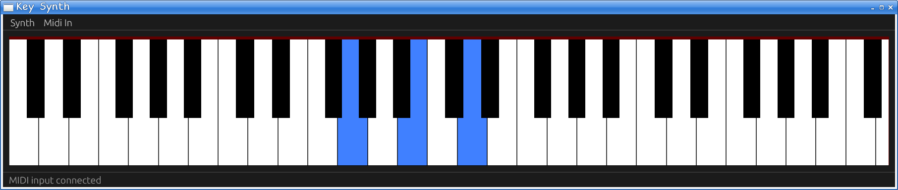

# key-synth

Small keyboard synth written in Rust using
[midir](https://crates.io/crates/midir) to read MIDI input,
[cpal](https://crates.io/crates/cpal) to output sound and
[egui](https://crates.io/crates/egui) for the UI.

The synth is currently very basic, synthesizing only pure sine waves
of the appropriate frequency for the pressed key, with up to 8 keys
playing at the same time.

Here's a screenshot of the main window showing a G major playing:

